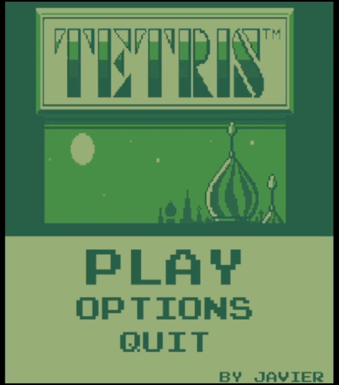

Tetris - Game Boy
============

 
 
## How to play
| Command      | Key           |   
|--------------|---------------|
| Move left    | Left          |
| Move right   | Right         |
| Rotate right | Up /          |
| Soft drop    | Down arrow    |

# Libraries

# Media

# Menu

# Game

# Start

# Credits
* Javier Gómez https://github.com/Javier-03
* StanislavPetrovV https://github.com/StanislavPetrovV/Python-Tetris
* AmaliaJulia https://github.com/AmaliaJulia/Tetris_Menu
